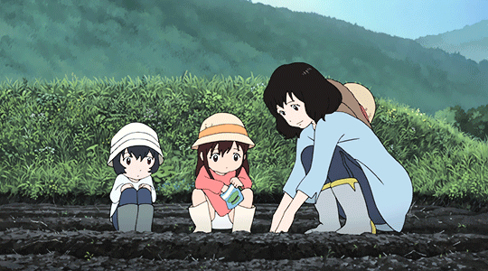

# Hestia
:brazil: Deusa do coração, da bondade e da família.

:us: Greek god of hearth and family.

 

## Objetivo

:brazil: Um projeto opensource para indexação de ongs com objetivo de ser regional, possibilitando ongs serem cadastradas, encontradas e ganharem visibilidade para usuários que buscam serviços que elas podem oferecer.

:us: An opensource project to index all regional NGOs that cares about people or animals, and make the access of them more easy.
